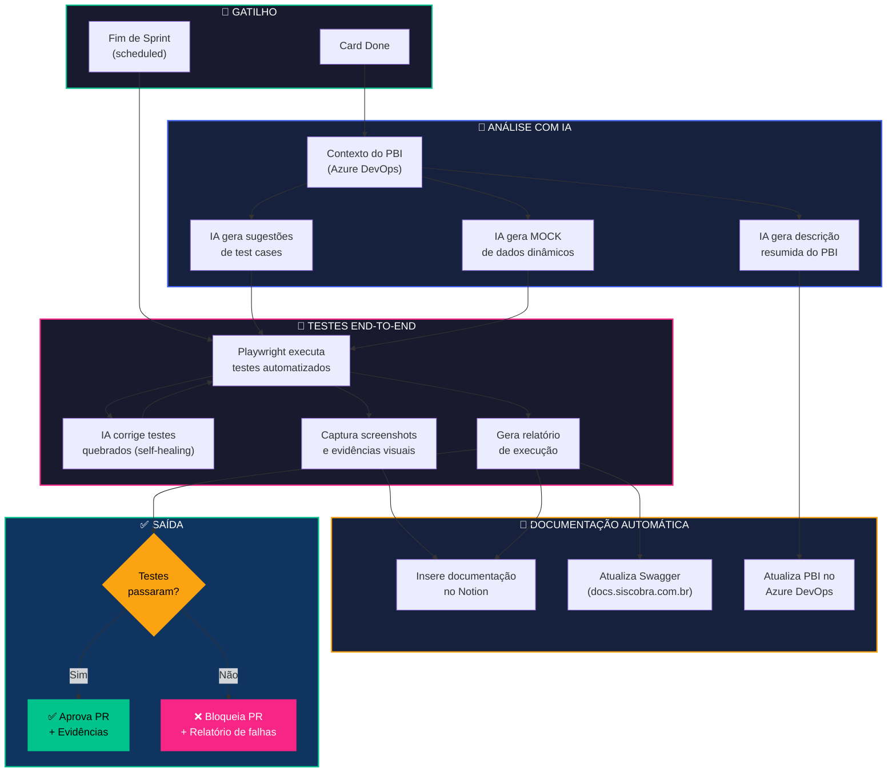

# Projeto Inovação — Siscobra Sistemas

> **Primeira reunião:** 12/02/2026  
> **Equipe:** Gabriel, Vinicius, Pedro, Leonardo, Gabrieli, Lucas Silva, André e Matheus  
> **Prêmio total:** R$ 5.000 (ideia ganhadora recebe cota extra)

---

## Sumário

| #  | Ideia | Responsável | Complexidade |
|----|-------|-------------|--------------|
| 1  | [QA Inteligente + Release Notes Automático](#ideia-8--qa-inteligente--release-notes-automático-com-ia) | Gabriel | Alta |

---

## Ideias — Detalhamento Completo

---

### Ideia 1 — QA Inteligente + Release Notes Automático com IA

| | |
|---|---|
| **Responsável** | Gabriel |
| **Complexidade** | Alta |

#### Problemas que resolve

| Problema | Impacto atual |
|----------|---------------|
| GeneXus 9 não suporta testes automatizados nativos | Testes manuais caros, lentos e com falhas |
| Regressões não detectadas | Multas contratuais e retrabalho |
| Clientes não sabem o que é entregue a cada sprint | Valor entregue invisível, suporte sobrecarregado |
| Documentação técnica desatualizada | Notion e Swagger ficam defasados |

#### Proposta central

> **Não reescrever o legado** — encapsulá-lo com uma camada de inteligência externa que **testa, documenta e comunica automaticamente**.

Um único pipeline com IA + Playwright que:
1. **Testa** o sistema por fora (sem depender do GeneXus internamente)
2. **Documenta** os resultados automaticamente (Notion, Swagger, Azure)
3. **Comunica** as mudanças ao cliente (release notes com evidências visuais)

#### Componentes da solução

| # | Componente | Descrição | Área |
|---|-----------|----------|------|
| 1 | **Geração de test cases com IA** | Com base na funcionalidades, a IA sugere casos de teste para os QAs | QA |
| 2 | **Descrição automática de PBI** | IA analisa o PBI no Azure e gera resumo estruturado | QA + Release |
| 3 | **Geração de MOCK inteligente** | Dados de teste gerados dinamicamente para bases de POC | QA |
| 4 | **Testes E2E com Playwright** | Suite de testes end-to-end que valida fluxos críticos | QA |
| 5 | **Captura de evidências visuais** | Playwright bate screenshots dos fluxos testados — usados em testes E no release notes | QA + Release |
| 6 | **Documentação automática** | Resultados inseridos no Notion + atualização do Swagger (docs.siscobra.com.br) | Docs |
| 7 | **Geração de release notes** | IA analisa PBIs da sprint e gera conteúdo em linguagem acessível ao cliente | Release |
| 8 | **Distribuição automática** | Envio por e-mail, portal do cliente ou notificação dentro do sistema | Release |

#### Fluxo da solução (Diagrama)

#### Leitura do fluxo

1. **Gatilho:** Card Done é marcado ou a sprint encerra
2. **Análise IA:** O contexto do PBI no Azure é analisado pela IA, que gera test cases, resumo do PBI e dados mock
3. **Testes E2E:** Playwright executa os testes. Se algo quebra, a IA tenta corrigir (self-healing). Screenshots e relatórios são gerados
4. **Documentação:** Os artefatos são inseridos automaticamente no Notion, Swagger e Azure
5. **Decisão:** Se os testes passam, o PR é aprovado com evidências. Se falham, é bloqueado com relatório detalhado

#### Resultado esperado

| Área | Resultado |
|------|-----------|
| **QA** | Fim das regressões não detectadas |
| **Financeiro** | Fim das multas contratuais por bugs em produção |
| **Comunicação** | Clientes recebem notas de atualização com evidências visuais automáticas |
| **Produtividade** | QAs ganham tempo para testes exploratórios em vez de repetitivos |
| **Documentação** | Notion, Swagger e Azure sempre atualizados sem esforço manual |
| **Percepção de valor** | Clientes veem o que é entregue a cada sprint — reduz churn |

#### Modelo de e-mail para Release Notes — Exemplo

Abaixo, um modelo visual de como o release notes seria entregue ao cliente. Utiliza as cores da marca Siscobra como referência.

> **Para visualizar corretamente**, abra o arquivo HTML anexo abaixo no navegador.

O arquivo de modelo pode ser encontrado em: [Release Notes - Modelo Email.html](Release%20Notes%20-%20Modelo%20Email.html)

